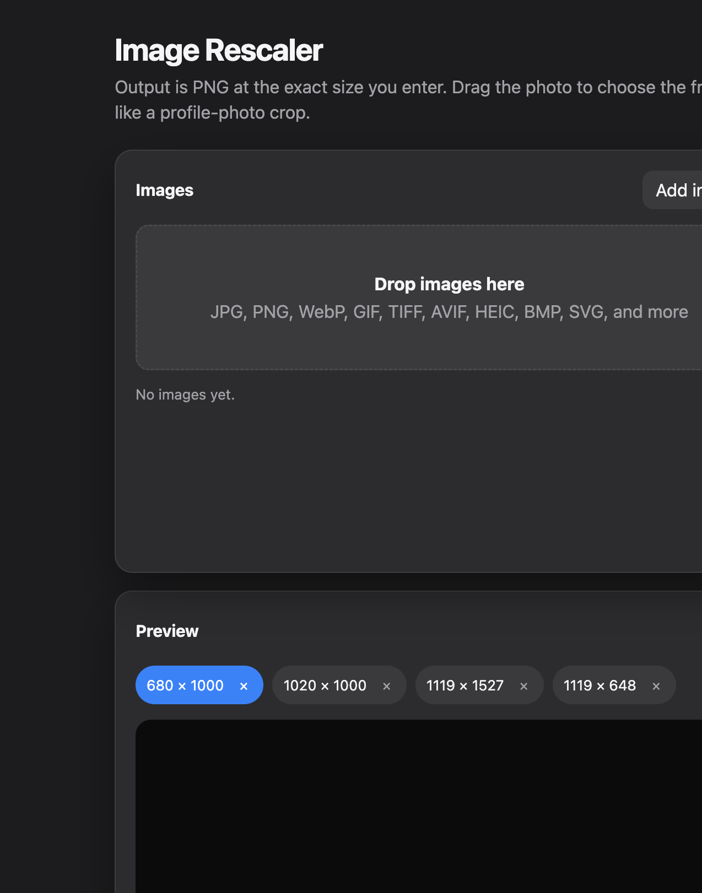

# Image Rescaler

**Exact-size PNG exports. One crop per resolution. No stretch.**

A native desktop app for production image batches — product shots, print layouts, and profile frames — where every output must match a target size and a chosen composition.

[](https://github.com/aneebji/img-rescaler)
[](https://www.electronjs.org/)
[](https://sharp.pixelplumbing.com/)
[](./LICENSE)

<p align="center">
  
</p>

---

## Why this exists

Generic resizers either pad empty bars or squash the photo. Image Rescaler treats each target size like a profile-photo update: the full image stays visible, a crop frame matches the output aspect ratio, and you pan or zoom until the frame is right. Every image × size keeps its own crop. Export is always lossless-friendly PNG at the exact pixel dimensions you asked for.

## Capabilities

- **Live crop editor** — drag to reframe, scroll to zoom, reset to a centered cover crop
- **Independent frames** — switch resolutions and keep a separate composition for each size
- **Exact PNG output** — `extract` → Lanczos3 resize → PNG, no letterboxing
- **Dated run folders** — each Rescale click writes `output/YYYY-MM-DD_HH-mm-ss/`
- **Broad ingest** — JPG, JPEG, JFIF, PNG, WebP, GIF, AVIF, TIFF, BMP, ICO, SVG, HEIC, HEIF (Sharp reads by magic bytes when the extension is missing)
- **EXIF-aware** — orientation is normalized before crop and export
- **Batch jobs** — one run, every selected image × every size, with progress and Finder reveal

## Default sizes

These presets load on launch and can be removed or extended:

| Width | Height | Aspect |
| ---: | ---: | --- |
| 680 | 1000 | Portrait |
| 1020 | 1000 | Near-square |
| 1119 | 1527 | Tall portrait |
| 1119 | 648 | Wide landscape |

Newly added sizes move to the front and stay selected so the last one you defined is the one you preview.

## Workflow

1. Drop images or use **Add images**.
2. Keep the defaults, or add more `width × height` targets.
3. Select a photo and a size. Drag and scroll until the crop is correct.
4. Click **Rescale**. Files land in a new timestamped folder as `{name}_{width}x{height}.png`.

## Quick start

Requires **Node.js 18+** and **macOS**.

```bash
git clone https://github.com/aneebji/img-rescaler.git
cd img-rescaler
npm install
npm run dev
```

`npm run dev` starts Vite and opens the Electron app.

| Script | Purpose |
| --- | --- |
| `npm run dev` | Local desktop app |
| `npm run build` | Renderer production bundle |
| `npm run package:mac` | Unsigned `.dmg` / `.zip` via electron-builder |

Packaged builds write next to the app as `output/`. In development, the same folder is created in the project root.

## Architecture

| Layer | Role |
| --- | --- |
| **Electron** | File dialogs, sandbox-safe preview IPC, Finder reveal |
| **Vite renderer** | Crop UI, per-image / per-size state |
| **Sharp** | Decode, EXIF rotate, extract, Lanczos3 resize, PNG encode |

```
src/                 UI (HTML, CSS, renderer)
electron/            Main process + preload bridge
output/              Dated export folders (gitignored)
release/             Packaged Mac artifacts (gitignored)
```

## Output contract

- Container: **PNG** (`compressionLevel: 9`)
- Geometry: exact target width × height
- Naming: `{basename}_{width}x{height}.png`
- Isolation: one folder per Rescale run so previous jobs stay intact
- Animated GIF / WebP: first frame only

## License

[MIT](./LICENSE) © 2026 Aneeb
