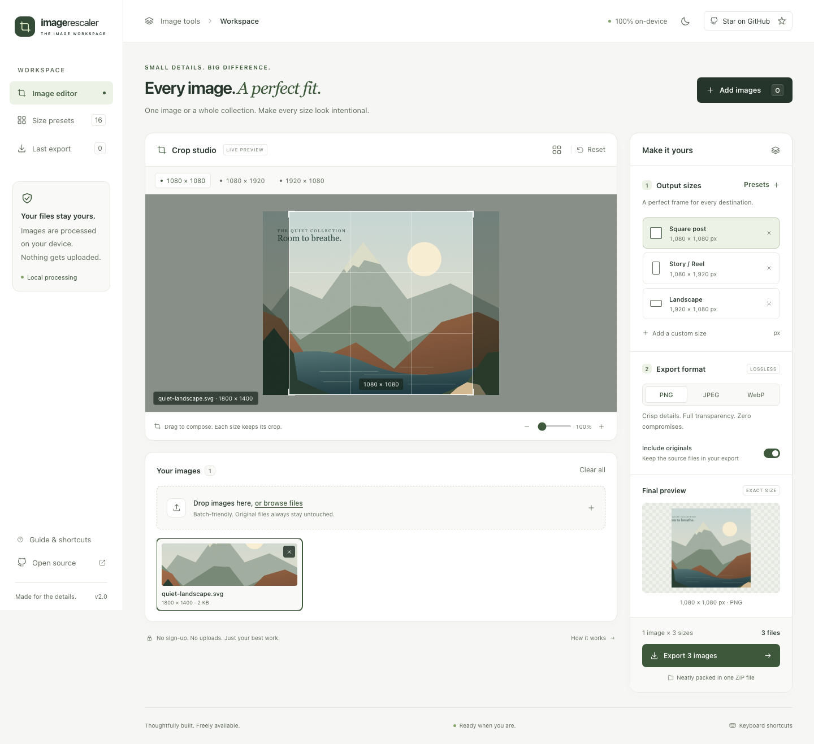
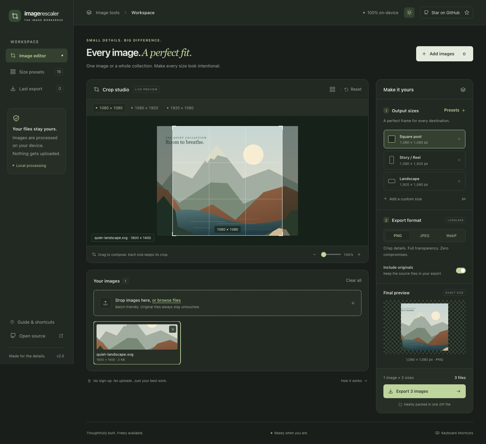
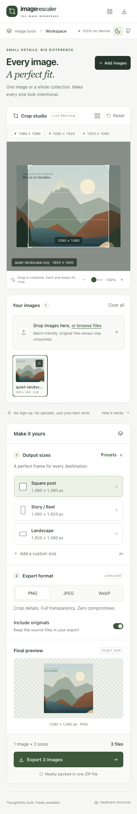

<div align="center">

# Image Rescaler

### Free online image resizer. One image. Every size. Your composition.

A private image resizer and crop workspace for product photos, social assets, and web images.\
Set your sizes, refine each crop, and batch-export PNG, JPEG, or WebP — in the [browser app](https://aneebji.github.io/img-rescaler/), with no uploads.

[](https://aneebji.github.io/img-rescaler/)
[](./LICENSE)
[](#privacy)
[](./CHANGELOG.md)

[**Launch the app →**](https://aneebji.github.io/img-rescaler/) · [Report a bug](https://github.com/aneebji/img-rescaler/issues/new?template=bug_report.yml) · [Suggest a feature](https://github.com/aneebji/img-rescaler/issues/new?template=feature_request.yml)

</div>



<details>
<summary>Explore the dark workspace and mobile layout</summary>





</details>

## A practical workspace for image delivery

Different destinations need different compositions. A product thumbnail, a portrait post, and a wide banner should each have a considered crop. Image Rescaler keeps a separate crop for every image and output size, then generates the whole batch at exact pixel dimensions.

Use the [browser app](https://aneebji.github.io/img-rescaler/) immediately, without an account, or run the Electron desktop app locally.

| Capability                   | What it does                                                                                                                  |
| ---------------------------- | ----------------------------------------------------------------------------------------------------------------------------- |
| **Batch processing**         | Add multiple images and generate every image × selected size combination.                                                     |
| **Visual crop control**      | Frame each composition with drag, zoom, and a live output preview. Each image and size keeps its own crop during the session. |
| **Useful size presets**      | Start with Social, Commerce, Web, or the original sizes, or enter custom pixel dimensions.                                    |
| **PNG, JPEG, WebP, and PSD** | Import photos and Photoshop **PSD/PSB** files, then export PNG, JPEG, or WebP with adjustable quality.                        |
| **Organized delivery**       | Download a ZIP in the browser or save to a local run folder on desktop. Include source originals when needed.                 |
| **A considered interface**   | Responsive layout, light and dark themes, and keyboard and touch crop controls.                                               |
| **Try before importing**     | Explore the browser workspace with the built-in sample image.                                                                 |
| **Local image processing**   | Images are decoded, cropped, and encoded on your device. No image upload service or account is required.                      |

## From source to export

1. **Add your images.** Use the file picker or drag files into the workspace, including Photoshop **PSD/PSB** (CMYK or RGB). Try the sample for a quick walkthrough.
2. **Choose your output sizes.** Add presets or custom dimensions. Multiple sizes produce multiple exports per image.
3. **Compose each crop.** Select an image and a size, then move or zoom the crop. Check the output preview before continuing.
4. **Set your export options.** Choose PNG, JPEG, or WebP, adjust quality where applicable, and decide whether to include originals.
5. **Export the batch.** Download the ZIP in the browser or open the destination folder on desktop. Review the result summary for any failed images.

### Supported formats

| Format                    | Role   | Notes                                                                                          |
| ------------------------- | ------ | ---------------------------------------------------------------------------------------------- |
| **PSD / PSB**             | Import | Reads the merged Photoshop composite, including CMYK and RGB 8-bit files. Layers are not kept. |
| **PNG**                   | Export | Graphics, transparent assets, and lossless output. Quality control does not apply.             |
| **JPEG**                  | Export | Photos and widely compatible delivery. Transparent pixels flatten onto white.                  |
| **WebP**                  | Export | Web images with transparency or lossy compression. Browser encoder availability may vary.      |
| **JPG, AVIF, SVG & more** | Import | Other rasters and vectors depend on the browser or Sharp decoder.                              |

The app performs conventional image resizing. Enlarging a small source does not recover detail that was absent from the original.

### Predictable output

Exports use names such as `product_1080x1080.webp`. When names collide, a numeric suffix keeps each output distinct. A browser export downloads as `ImageRescaler_YYYY-MM-DD_HH-mm-ss.zip`; desktop exports go into a dated folder. If enabled, untouched source files are included in an `originals/` subfolder.

### Keyboard controls

| Key                  | Action                      |
| -------------------- | --------------------------- |
| `O`                  | Add images                  |
| Arrow keys           | Move the selected crop      |
| `Shift` + arrow keys | Move the crop faster        |
| `+` / `−`            | Zoom the selected crop      |
| `0`                  | Reset the selected crop     |
| `?`                  | Open keyboard shortcut help |

Workspace shortcuts are ignored while typing in a form field.

## Privacy

Your selected images stay on your device. The browser app processes files using browser image APIs and packages downloads locally with JSZip. The desktop app uses Sharp and writes to your chosen local folder. The app does not upload image files to a server.

The hosted page still makes normal requests to load the application, and the hosting provider may log those requests. Keeping an original in your export also keeps that original file's metadata. Review originals before sharing an archive when metadata matters.

Image files and crop edits are session data, not a saved project. Export your work before refreshing or closing the app.

## Browser and desktop

|                    | Browser                                                                   | Desktop                                              |
| ------------------ | ------------------------------------------------------------------------- | ---------------------------------------------------- |
| **Run it**         | [Open the live app](https://aneebji.github.io/img-rescaler/)              | Run locally from source                              |
| **Processing**     | Browser image decoding and Canvas                                         | Sharp in Electron's main process                     |
| **Delivery**       | ZIP download                                                              | Dated local output folder                            |
| **Source formats** | Browser-decoded images plus Photoshop **PSD/PSB** (CMYK or RGB composite) | Sharp plus the same **PSD/PSB** composite decode     |
| **Packaging**      | Static site hosted on GitHub Pages                                        | macOS `.dmg` and `.zip` build configuration included |

### Current limits

- Output dimensions are limited to 8,192 pixels per side and 32 megapixels per image. Large source images and extensive batches can still consume significant memory; available capacity depends on the browser and device.
- Animated inputs are processed as still images; animation is not preserved.
- Photoshop **PSD/PSB** files use the merged composite (CMYK or RGB, 8-bit). Layers, adjustment stacks, and smart objects are not preserved. Very large PSDs can take time and memory, especially in the browser.
- HEIC, HEIF, TIFF, and other specialist source formats depend on decoder support. A file extension alone does not guarantee compatibility.
- Browser and desktop encoders can produce different file sizes and pixel results. This is not a color-managed print production workflow.
- The project does not provide cloud storage, project sync, background uploads, or AI upscaling.
- macOS packaging is configured for local builds. Locally generated packages are unsigned unless you supply your own signing configuration; Windows and Linux installers are not configured.

## Develop locally

Use **Node.js 22.12 or newer** and npm. Native dependencies are installed for the machine running the installation.

```bash
git clone https://github.com/aneebji/img-rescaler.git
cd img-rescaler
npm ci
npm run dev:web
```

Open the local URL printed by Vite. To launch the desktop app instead:

```bash
npm run dev
```

| Command               | Purpose                                                       |
| --------------------- | ------------------------------------------------------------- |
| `npm run dev:web`     | Start the Vite browser development server.                    |
| `npm run dev`         | Start Vite and launch Electron.                               |
| `npm run check`       | Run source checks.                                            |
| `npm test`            | Run automated tests.                                          |
| `npm run test:e2e`    | Run Chromium workflow and image export tests with Playwright. |
| `npm run build`       | Build the production renderer into `dist-renderer/`.          |
| `npm run preview:web` | Preview the production renderer after building.               |
| `npm run build:pages` | Generate the static GitHub Pages site in `docs/`.             |
| `npm run package:mac` | Build local macOS `.dmg` and `.zip` artifacts in `release/`.  |

### Architecture

The browser and desktop applications share the same renderer. A small API boundary selects browser file handling and Canvas processing, or Electron IPC and Sharp processing, depending on the runtime.

```text
src/                    Shared interface and browser adapter
electron/               Desktop main process and preload bridge
tests/                  Automated regression tests
.github/                Contribution and issue templates
contrib/                Optional GitHub Actions workflow
docs/                   Generated GitHub Pages site
media/                  Repository screenshots and presentation assets
dist-renderer/          Local production build (ignored by Git)
output/                 Default local desktop exports (ignored by Git)
release/                Desktop package artifacts (ignored by Git)
```

### Validation

Before opening a pull request, run:

```bash
npm run check
npm test
npm run build
```

Browser tests also check automated accessibility rules for the editor and dialogs. A ready-to-enable GitHub Actions workflow is included in [`contrib/github-actions-checks.yml`](./contrib/github-actions-checks.yml). To enable it, copy the file to `.github/workflows/ci.yml` and commit with an account or token that has permission to write workflows. For UI or export changes, also walk through importing images, editing separate crops, exporting each format, and checking the downloaded files. See [CONTRIBUTING.md](./CONTRIBUTING.md) for the review checklist.

To run the browser regression suite locally, install its browser once, then start the tests. Playwright starts the development server automatically:

```bash
npx playwright install chromium
npm run test:e2e
```

### Publish to the existing live URL

GitHub Pages serves this repository's `main` branch from `/docs` at **[aneebji.github.io/img-rescaler](https://aneebji.github.io/img-rescaler/)**.

```bash
npm run build:pages
```

Commit the source changes and generated `docs/` output, then push to `main` through the normal review process. GitHub Pages deploys the updated site at the same URL. Relative asset paths are configured in `vite.config.mjs` for the repository subpath.

## Contribute

Bug fixes, accessibility improvements, new test coverage, and carefully scoped workflow improvements are welcome. Read the [contribution guide](./CONTRIBUTING.md), open an [issue](https://github.com/aneebji/img-rescaler/issues), or submit a pull request with the problem, change, and verification steps.

Please report potential vulnerabilities using the guidance in [SECURITY.md](./SECURITY.md), without exposing sensitive details in a public issue.

## License

[MIT](./LICENSE) © 2026 Aneeb. You may use, modify, and distribute the project, including commercially, under the license terms.
